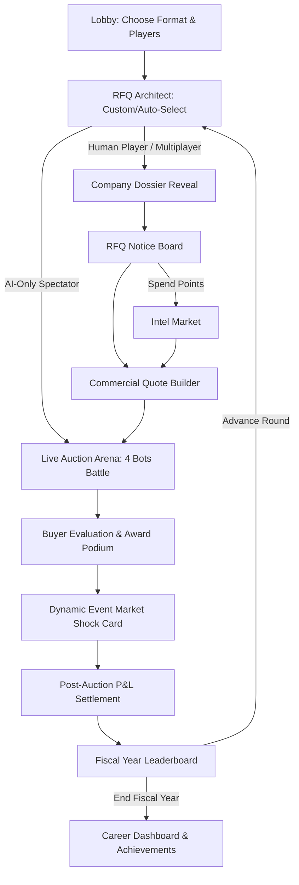

# System UI/UX & Design Specification: SCM Vendor Bidding & Auction Simulator

**Document:** `Design.md`
**Version:** 3.0 (Color System Audit + Gamification Expansion)
**Target Platform:** Web (Responsive Desktop, Tablet, and Mobile)
**Aesthetic Themes:** Dual-Theme Architecture — **Dark Mode (Tactical Command Navy)** & **Light Mode (Executive High-Contrast Slate)**

---

## Changelog from v2.0

| Area | Change | Why |
|---|---|---|
| Core tokens | Darkened `Secondary Well` in dark mode; added usage caveat on `Text Tertiary` | v2.0's well color sat too close to the app background (near-zero contrast between canvas and inset), and tertiary text was borderline on AA for small text |
| New tokens | Added Focus Ring, Disabled/Idle, Overlay/Backdrop, Info/Neutral | Missing states — v2.0 had no accessible focus indicator or disabled styling defined |
| New system | **Rank Tier Color System** (§1.3) | v2.0 only colored Tier 5 ("Tycoon"); Tiers 1–4 had no assigned palette, so the XP ladder wasn't visually legible |
| New system | **Auction Format Accent System** (§1.4) | English/Dutch/Japanese had emoji but no color identity, so players couldn't color-scan which mode they were in |
| New system | **Data Visualization Palette** (§1.5) | P&L and leaderboard charts had no defined, colorblind-safe series palette |
| New system | **Elevation & Shadow System** (§1.6) | Dark mode had no shadow spec; cards relied on border alone, which flattens on OLED screens |
| Gamification | Added Streaks, Reward Choreography table, Prestige system (§2.3–2.5) | v2.0's gamification was XP/level/confetti only; no retention loop beyond one career ladder |
| Accessibility | Added reduced-motion and photosensitivity guidance for `shock()` event FX | Flicker/vignette effects on dynamic shocks are a real photosensitivity risk if unbounded |

---

## 1. Dual-Theme Visual Language & Design Tokens

The application features a fully reactive dual-theme engine (`ThemeProvider` with `localStorage` persistence and `class="dark"` / `class="light"` on root HTML) ensuring high contrast and readability across all screens.

### 1.1 Core Token Matrix (revised)

| Semantic Token | Dark Mode Token (Hex / Class) | Light Mode Token (Hex / Class) | Semantic Usage |
|---|---|---|---|
| **App Background** | `#090D16` (`bg-slate-950`) | `#F1F5F9` (`bg-slate-100`) | Main application canvas backdrop |
| **Primary Surface** | `#111827` (`bg-slate-900`) | `#FFFFFF` (`bg-white`) | Card containers, modals, table bodies |
| **Secondary Well** | `#060A12` (`bg-slate-950/95`) ⚠️*changed* | `#F8FAFC` (`bg-slate-50`) | Inset metric cards, form wells, code boxes — now visibly recessed below Primary Surface in dark mode |
| **Card Border** | `#1F2937` (`border-slate-800`) | `#CBD5E1` (`border-slate-300`) | Card containers, dividers, cell borders |
| **Text Primary** | `#F9FAFB` (`text-slate-100`) | `#0F172A` (`text-slate-900`) | Headings, large numeric metrics, winner titles |
| **Text Secondary** | `#CBD5E1` (`text-slate-300`) | `#1E293B` (`text-slate-800`) | Subheadings, active labels, table rows |
| **Text Muted** | `#94A3B8` (`text-slate-400`) | `#475569` (`text-slate-600`) | Formula descriptions, inactive captions |
| **Text Tertiary** | `#64748B` (`text-slate-500`) | `#64748B` (`text-slate-500`)¹ | Timestamps, currency helper units |
| **Brand Primary** | `#6366F1` (`indigo-600`) | `#4F46E5` (`indigo-600`) | Primary action buttons, active navigation pills |
| **Profit / Success** | `#10B981` (`text-emerald-400`) | `#047857` (`text-emerald-700`) | Banked profit, contract awards, margin > 15% |
| **Loss / Penalty** | `#F43F5E` (`text-rose-400`) | `#BE123C` (`text-rose-700`) | Deficits, cost surges, loss-leader bids (<0.7 FLC) |
| **Alert / Contingency** | `#F59E0B` (`text-amber-400`) | `#B45309` (`text-amber-700`) | Risk buffers, countdown clocks, dynamic shocks |
| **Buyer Weight / Tech** | `#06B6D4` (`text-cyan-400`) | `#0E7490` (`text-cyan-700`) | RFQ specifications, Intel leaks, SLA tiers |
| **Info / Neutral** *(new)* | `#38BDF8` (`text-sky-400`) | `#0369A1` (`text-sky-700`) | Informational callouts, tooltips, "how this is calculated" hints — distinct from Buyer Weight cyan |
| **Focus Ring** *(new)* | `#818CF8` (`ring-indigo-400`), 2px, 2px offset | `#4F46E5` (`ring-indigo-600`), 2px, 2px offset | Keyboard focus outline on every interactive element |
| **Disabled / Idle** *(new)* | bg `#1E293B` / text `#475569` | bg `#E2E8F0` / text `#94A3B8` | Idle vendor rows, disabled buttons, unavailable quote fields |
| **Overlay / Backdrop** *(new)* | `rgba(3,7,18,0.75)` | `rgba(15,23,42,0.40)` | Behind modals (Evaluation Reveal, Event Card, Manual) |

¹ *Text Tertiary uses the same hex in both modes because slate-500 clears ~4.6:1 against both `#111827`/`#090D16` and `#FFFFFF`/`#F1F5F9`. Reserve it for 14px+ or semibold text only; for anything smaller or higher-stakes, use Text Muted instead, which has a wider safety margin.*

---

### 1.2 Functional Badge Tokens

| Badge Type | Dark Mode Palette | Light Mode Palette | Example Usage |
|---|---|---|---|
| **Success / Won** | `bg-emerald-950 text-emerald-300 border-emerald-800` | `bg-emerald-50 text-emerald-800 border-emerald-300` | Contract Awarded, On-Time Delivery |
| **Brand / Quoting** | `bg-indigo-950 text-indigo-300 border-indigo-800` | `bg-indigo-50 text-indigo-800 border-indigo-300` | RFQ Stage, ISO-9001 Approved |
| **Warning / Buffers** | `bg-amber-950 text-amber-300 border-amber-800` | `bg-amber-50 text-amber-800 border-amber-300` | 8% Risk Contingency, Soft-Close Clock |
| **Danger / Loss-Leader** | `bg-rose-950 text-rose-300 border-rose-800` | `bg-rose-50 text-rose-800 border-rose-300` | Winner's Curse (<0.70 FLC), Disqualified |
| **Info** *(new)* | `bg-sky-950 text-sky-300 border-sky-800` | `bg-sky-50 text-sky-800 border-sky-300` | Tooltip callouts, "New rule this round" flags |
| **Idle / Disabled** *(new)* | `bg-slate-800 text-slate-500 border-slate-700` | `bg-slate-100 text-slate-400 border-slate-300` | Vendors who didn't bid this round |

---

### 1.3 Rank Tier Color System *(new)*

The XP ladder (§2.1) had five named tiers in v2.0 but only Tier 5 had an assigned color. Every tier now gets a distinct, ordered hue so the Career Progression Ladder, navbar badge, and leaderboard crowns are scannable at a glance — and the ordering (bronze → silver → gold → diamond → prestige purple) follows a familiar competitive-game convention players already recognize.

| Tier | Rank | Dark Mode | Light Mode | Badge Style |
|---|---|---|---|---|
| 1 | 🥉 Junior Procurement Analyst | `text-orange-400` `#FB923C` | `text-orange-700` `#C2410C` | `bg-orange-950/50 border-orange-800` → `bg-orange-50 border-orange-300` |
| 2 | 🥈 Strategic Sourcing Specialist | `text-slate-300` `#CBD5E1` | `text-slate-600` `#475569` | `bg-slate-800 border-slate-600` → `bg-slate-100 border-slate-400` |
| 3 | 🥇 Senior Commercial Strategist | `text-yellow-400` `#FACC15` | `text-yellow-700` `#A16207` | `bg-yellow-950/50 border-yellow-800` → `bg-yellow-50 border-yellow-300` |
| 4 | 💎 VP of Supply Chain & Bidding | `text-sky-400` `#38BDF8` | `text-sky-700` `#0369A1` | `bg-sky-950/50 border-sky-800` → `bg-sky-50 border-sky-300` |
| 5 | 👑 Chief Commercial Tycoon | `text-purple-400` `#C084FC` | `text-purple-700` `#7E22CE` | `bg-purple-950/50 border-purple-800` → `bg-purple-50 border-purple-300` |

Navbar XP bar fills with a **gradient that previews the next tier's color** at its leading edge (e.g., a Tier-2 Silver player's XP bar fades from silver into a thin gold sliver as they approach the Tier-3 threshold) — a small, motivating "almost there" cue.

---

### 1.4 Auction Format Accent System *(new)*

Each auction format gets a distinct accent used for its icon, the arena header bar, and the format-select card border in Lobby, so players build a color association with format *before* they build one with the rules — useful given all three modes reuse the same base layout.

| Format | Dark Mode Accent | Light Mode Accent | Rationale |
|---|---|---|---|
| 🔨 Reverse English | `#FB923C` (orange-400) | `#C2410C` (orange-700) | Fast, aggressive, continuous — warm/hot hue matches the rapid counter-bid pace |
| ⏳ Reverse Dutch | `#2DD4BF` (teal-400) | `#0F766E` (teal-700) | Cool, single-decision tension — deliberately *not* amber, to avoid collision with the Alert/Contingency token used inside the same screen |
| 🇯🇵 Japanese Clock | `#A78BFA` (violet-400) | `#6D28D9` (violet-700) | Distinct from Brand Primary indigo despite being adjacent on the wheel — signals "related to bidding, but a different mode" |

Applied as a **4px top border** on format cards (Lobby), the **arena title bar background** (10% opacity tint over Primary Surface), and the **live ticker digits** in the Auction Arena screen.

---

### 1.5 Data Visualization Palette *(new)*

For P&L comparison charts, leaderboard trend lines, and margin-over-time sparklines. Ordered so the first four remain distinguishable under deuteranopia/protanopia simulation (validated against an Okabe-Ito–style separation), with Slate reserved as the "everyone else / other" catch-all series.

| Series | Hex (both modes — fills, not text) | Use |
|---|---|---|
| 1 — Primary vendor / self | `#6366F1` (indigo-500) | The player's own line/bar, always series 1 |
| 2 — Comparison vendor A | `#2DD4BF` (teal-400) | |
| 3 — Comparison vendor B | `#F59E0B` (amber-500) | |
| 4 — Comparison vendor C | `#F43F5E` (rose-500) | |
| 5 — Comparison vendor D | `#38BDF8` (sky-400) | |
| 6 — Target/benchmark line | `#94A3B8` (slate-400), dashed stroke | FLC line, budget ceiling reference |
| 7 — Positive delta fill | `#10B981` @ 20% opacity | Area-fill under margin-improvement zones |
| 8 — Negative delta fill | `#F43F5E` @ 20% opacity | Area-fill under margin-erosion zones |

Chart gridlines/axis text always use **Text Muted**, never Text Tertiary (charts are exactly the "higher-stakes small text" case the tertiary-token caveat in §1.1 warns about).

---

### 1.6 Elevation & Shadow System *(new)*

v2.0 defined borders but no shadow spec — on dark backgrounds a border alone can't communicate elevation (a bordered card and the canvas behind it can read as the same plane). Two elevation levels cover the whole app:

| Level | Used For | Dark Mode | Light Mode |
|---|---|---|---|
| **1 — Resting card** | RFQ cards, vendor rows, dashboard tiles | `0 1px 2px rgba(0,0,0,0.45)` + `border-slate-800` | `0 1px 3px rgba(15,23,42,0.08)` + `border-slate-300` |
| **2 — Floating / modal** | Evaluation Reveal, Event Card, Manual, toasts | `0 12px 32px rgba(0,0,0,0.6)` + faint `1px inset highlight #1F2937` on top edge | `0 16px 40px rgba(15,23,42,0.18)` |

Hover state on interactive cards (Lobby format cards, RFQ tiles): elevate from Level 1 → a mid-step (`0 4px 12px`) with a **2px lift** (`translateY(-2px)`), 150ms ease-out — same timing both themes.

---

### 1.7 Typography & Numerical Rules

1. **Sans-Serif Font Family**: `Inter`, system UI fonts for maximum clarity across executive tables and forms.
2. **Fixed-Width Tabular Figures**: `JetBrains Mono`, `Courier New` for real-time tickers, currency calculations, countdown timers, and unit cost breakdowns.
3. **Currency Strict Formatting**: Always `$XX,XXX` with comma thousands separators. Negative balances format explicitly as `-$XX,XXX`, always in Loss/Penalty color regardless of surrounding context.
4. **Percentages**: One decimal place `XX.X%` (e.g., `21.4% Realized Margin`).
5. **Color-coding numbers is never the only signal** *(new rule)*: every colored profit/loss/warning figure is paired with a `+`/`–` sign or an icon (per §6.2) — color alone never carries the meaning.

---

## 2. Gamification & Progression Subsystem

### 2.1 Career XP & Level Hierarchy

$$\text{Total XP} = \left\lfloor\frac{\text{Banked Profit}}{200}\right\rfloor + (500 \times \text{Contracts Won}) + (250 \times \text{Disciplined Walkaways}) + (10 \times \text{Reputation})$$

```
┌─────────────────────────────────────────────────────────────────────────────┐
| 🎖️ CAREER PROGRESSION LADDER                        (tier colors — see §1.3)|
├─────────────────────────────────────────────────────────────────────────────┤
| Lvl 1: 🥉 Junior Procurement Analyst      (0 - 999 XP)       Orange         |
| Lvl 2: 🥈 Strategic Sourcing Specialist   (1,000 - 2,999 XP) Silver         |
| Lvl 3: 🥇 Senior Commercial Strategist    (3,000 - 6,999 XP) Gold           |
| Lvl 4: 💎 VP of Supply Chain & Bidding    (7,000 - 14,999 XP)Diamond (Sky)  |
| Lvl 5: 👑 Chief Commercial Tycoon         (15,000+ XP)       Prestige Purple|
└─────────────────────────────────────────────────────────────────────────────┘
```

### 2.2 Live Gamification Features & Visual FX

* **Navbar Live XP Progress Bar**: real-time level badge and progress bar, gradient preview of next tier (§1.3).
* **Celebration Confetti FX**: `canvas-confetti`, triggered on contract wins, high realized margins, leaderboard podium finishes. Palette pulls from the Data Viz set (§1.5) plus the current tier color — a Tier-4 player's confetti includes sky-blue flecks, not just generic gold.
* **Synthesized Web Audio Engine** (`src/utils/soundEffects.ts`), 1-click mute toggle (`🔊`/`🔇`):
  * `tick()` — countdown chime
  * `bid()` — counter-bid chime
  * `buzz()` — Dutch buzz-in
  * `award()` — quad-harmonic fanfare
  * `shock()` — low sawtooth market-shock alert

### 2.3 Reward & Feedback Choreography *(new)*

Every sound effect in v2.0 fired with no defined visual partner. Sound, color, and motion are now paired explicitly so each event reads the same way whether a player has audio on, off, or is glancing at a second monitor:

| Trigger | Sound | Color Cue | Motion |
|---|---|---|---|
| Countdown < 10s | `tick()` | Timer chip border shifts Alert amber | Gentle 1px pulse, 1x/sec |
| Countdown < 5s | `tick()` (faster) | Timer chip shifts to Loss/Penalty rose | Pulse continues — **no strobe** (see §6.4) |
| Counter-bid placed | `bid()` | Ticker digits flash Brand Primary for 200ms, fade to Text Primary | Digits count down with a 150ms roll |
| Dutch buzz-in | `buzz()` | Full-width Alert amber flash bar, 300ms, single pulse | Buzzer button briefly scales 1.0→1.08→1.0 |
| Contract awarded | `award()` | Winner's row glows Profit/Success emerald; confetti (§2.2) | Row lifts to Elevation 2 (§1.6) for 2s, settles back |
| Dynamic shock drawn | `shock()` | Screen-edge vignette in Alert amber (or rose if severity is high) | Single soft fade-in/out, 600ms — **not** a flicker (see §6.4) |
| XP tier-up | — (new `levelup()` chime, gentle rising arpeggio) | Full navbar badge cross-fades old tier color → new tier color | Badge briefly scales 1.0→1.15→1.0 |

### 2.4 Streaks & Discipline Tracking *(new)*

To reward the *judgment* half of the game, not just wins:

* **Delivery Streak** — consecutive on-time, on-spec deliveries. Displayed as a small flame/streak counter next to the company name, using Alert amber at 3+, escalating to Profit emerald at 7+ (streak "on fire" visually reinforces good discipline rather than reckless bidding).
* **Discipline Streak** — consecutive rounds where a player either won at healthy margin *or* correctly walked away from a negative-EV bid. This is the visual counterpart to the "Discipline Index" stat from the GDD (§11.3) — same orange/gold/sky/purple tier-color logic applies as it climbs, echoing §1.3 so streak color and career tier color share one visual grammar.
* Both streaks reset (not decay) on a bad outcome, shown with a brief single rose flash — not punishing, just clear.

### 2.5 Seasonal Prestige *(new)*

Once a player reaches Tier 5 (👑 Chief Commercial Tycoon), they may **Prestige Reset**: XP returns to 0 and the ladder restarts, but the player keeps a permanent **Prestige Crown** badge (Prestige Purple base with a thin gold trim, stacking — Prestige I, II, III...) shown next to their name everywhere, including in future lobbies. This gives long-term players a reason to keep playing past the top of the ladder without inflating the base XP formula indefinitely.

---

## 3. Screen Flows & Information Architecture



---

## 4. Screen Specifications & Wireframes

*(Wireframes unchanged from v2.0 — see below for the color/token now applied at each screen. ASCII layouts retained as structural reference; visual color is applied per the tokens in §1.)*

---

### Screen 1: Lobby & Multiplayer Room Architect (`Lobby.tsx`)

```
┌─────────────────────────────────────────────────────────────────────────────┐
│ 🏛️ SCM AUCTION SIMULATOR      [📖 Manual] [☀️/🌙] [🔊/🔇] [🥈 Lvl 2: 1.4k XP]│
├─────────────────────────────────────────────────────────────────────────────┤
│                                                                             │
│   1. CHOOSE AUCTION FORMAT:                                                 │
│   [ 🔨 Reverse English ]   [ ⏳ Reverse Dutch ]   [ 🇯🇵 Japanese Clock ]     │
│                                                                             │
│   2. INSTANT ACTION MODES:                                                  │
│   ┌──────────────────────────────────────────────────────────────────────┐  │
│   │ 🤖 Build RFQ & Watch 4 AI Bots Battle   🎮 Play Solo vs 3 AI Bots   │  │
│   └──────────────────────────────────────────────────────────────────────┘  │
│                                                                             │
│   ── OR HOST CUSTOM MULTIPLAYER ROOM ────────────────────────────────────   │
│                                                                             │
│   Host a New Room:                          Join Room:                      │
│   • Company: [ Apex Global Inc. ]           • Company: [ Titan Corp ]       │
│   • Scenario: [ Automotive Mfg. ▼]          • Code: [ AUCT-42 ]             │
│   • Rounds: [ 3 Rounds (Quick)  ▼]                                          │
│   • Players: [ 2P | 3P | 4P | 6P | 8P ]    [ 🚪 JOIN ROOM NOW ]            │
│   • [ 🚀 CREATE 4-PLAYER ROOM & GENERATE CODE ]                             │
│                                                                             │
│   Lobby Waiting Room (Room AUCT-42):                                        │
│   Connected Vendors: (2/4) • [ 🤖 1-Click Auto-Fill (2 AI Bots Needed) ]    │
│   • 🟢 Apex Global (Host - You)                                             │
│   • 🟢 Titan Corp (Connected via Mobile)                                    │
│   • 🤖 Vulcan Heavy Ind. (Aggressive AI)                                    │
│   • 🤖 SafeBuild Dynamics (Conservative AI)                                 │
│                                                                             │
│   [ 🚀 START FISCAL ROUND (HOST ONLY) ]                                     │
└─────────────────────────────────────────────────────────────────────────────┘
```
**Color application**: each format button carries its §1.4 accent as a 4px top border, unselected state uses Text Muted icon/label, selected state fills the icon in full accent color. Navbar XP badge uses the current Rank Tier color (§1.3) — here, Silver.

---

### Screen 2: RFQ Architect & 1-Click Auto-Select (`RfqBuilder.tsx`)

```
┌─────────────────────────────────────────────────────────────────────────────┐
│ 📑 RFQ TENDER ARCHITECT — ROUND 1 OF 3                  [🎲 Auto-Fill RFQ] │
├─────────────────────────────────────────────────────────────────────────────┤
│                                                                             │
│  Industry Scenario: [ Manufacturing & Automotive ▼]                         │
│  Auction Format: 🔨 Reverse English (Live Counter-Bids)                     │
│                                                                             │
│  Commercial & Operational Constraints:                                      │
│  • Contract Budget Ceiling: [$ 450,000      ] (Max buyer allocation)        │
│  • Required Delivery Time:  [ 28 Days       ]                               │
│  • Payment Delay:           [ 30 Days (Net-30) ]                            │
│  • Labor Hours: [ 2,200 ] • Rate: [$ 48/hr ] • Materials Qty: [ 1,100 ]     │
│                                                                             │
│  Mandatory Compliance Gates:                                                │
│  [x] ISO-9001 Quality  [x] CyberSec Baseline  [ ] Zero-Defect SLA           │
│                                                                             │
│  Buyer Multi-Criteria Scoring Weights:                                      │
│  • Price Weight:       35% [==================●==================]          │
│  • Quality Weight:     20% [==========●==========================]          │
│  • Timeline Weight:    15% [=======●=============================]          │
│  • Reputation Weight:  15% [=======●=============================]          │
│  • Sustainability/SLA: 15% [=======●=============================]          │
│                                                                             │
│  [ 🚀 PUBLISH RFQ & START BIDDING PHASE → ]                                 │
└─────────────────────────────────────────────────────────────────────────────┘
```
**Color application**: format label uses the English orange accent inline. Weight sliders use Buyer Weight cyan for filled track, Card Border for unfilled track. Compliance checkboxes use Success emerald when checked.

---

### Screen 3: Live Auction Arena (`AuctionArena.tsx`)

```
┌─────────────────────────────────────────────────────────────────────────────┐
│ 🔨 LIVE REVERSE ENGLISH AUCTION                         ⏱️ Clock: 00:18     │
├─────────────────────────────────────────────────────────────────────────────┤
│                                                                             │
│                     CURRENT LOWEST BID: $364,000                            │
│                     Held by: 🤖 Vulcan Heavy Ind. (Aggressive AI)           │
│                                                                             │
│  ── LIVE BID ACTIVITY LOG ───────────────────────────────────────────────   │
│  • 16:12:08 - Vulcan Heavy placed counter-bid: $364,000 (-$4,000)           │
│  • 16:12:07 - Matrix Dynamic placed counter-bid: $368,000 (-$2,000)         │
│  • 16:12:05 - Apex SafeBuild placed counter-bid: $370,000 (-$5,000)         │
│  • 16:12:01 - Echo Mirror matched leader: $375,000                          │
│                                                                             │
│  Your Fully Loaded Cost: $315,570 | Current Potential Margin: 15.3%         │
│                                                                             │
│  [ ⬇️ Bid -$2,000 ($362k) ] [ ⬇️ Bid -$5,000 ($359k) ] [ ⏩ Skip to Winner]│
└─────────────────────────────────────────────────────────────────────────────┘
```
**Color application**: header bar tinted with the format accent at 10% opacity (§1.4). Clock chip follows the countdown color choreography (§2.3). "Current Potential Margin" number uses Profit emerald if positive/healthy, Alert amber if thin (<5%), Loss rose if the current lowest bid would put the player below FLC.

---

### Screen 4: Buyer Evaluation & Multi-Criteria Reveal (`EvaluationModal.tsx`)

```
┌─────────────────────────────────────────────────────────────────────────────┐
│ 🏆 PROCUREMENT AWARD DECISION (§5)                      🎉 +500 XP EARNED   │
├─────────────────────────────────────────────────────────────────────────────┤
│                                                                             │
│  Contract Awarded to: 🟢 Vulcan Heavy Ind. (Score: 84.8 / 100)              │
│  Final Contract Price: $364,000                                             │
│                                                                             │
│  Scoring Breakdown:                                                         │
│  ┌──────────────────┬──────────┬──────────┬──────────┬──────────┬─────────┐ │
│  │ Vendor           │ Price    │ Quality  │ Timeline │ Rep.     │ TOTAL   │ │
│  ├──────────────────┼──────────┼──────────┼──────────┼──────────┼─────────┤ │
│  │ 🥇 Vulcan Heavy  │ 35.0/35  │ 16.0/20  │ 15.0/15  │ 13.8/15  │ 84.8 pts│ │
│  │ 🥈 Apex SafeBuild│ 28.5/35  │ 20.0/20  │ 14.0/15  │ 15.0/15  │ 82.5 pts│ │
│  │ 🥉 Matrix Dynamic│ 31.0/35  │ 17.5/20  │ 13.0/15  │ 14.0/15  │ 80.5 pts│ │
│  │ ❌ Echo Mirror   │ DISQUALIFIED: Failed CyberSec Compliance Gate           │ │
│  └──────────────────┴──────────┴──────────┴──────────┴──────────┴─────────┘ │
│                                                                             │
│  [ DRAW DYNAMIC EVENT SHOCK CARD → ]                                        │
└─────────────────────────────────────────────────────────────────────────────┘
```
**Color application**: modal renders at Elevation 2 over the Overlay/Backdrop token. Winner row background tinted Success emerald at low opacity; disqualified row tinted Danger rose. "+500 XP" chip uses the current/next Rank Tier gradient from §2.1.

---

### Screen 5: Post-Auction P&L Breakdown & All-Vendor Matrix (`PnLBreakdown.tsx`)

```
┌─────────────────────────────────────────────────────────────────────────────┐
│ 📊 CONTRACT SETTLEMENT & P&L DEBRIEF: ROUND 1                               │
├─────────────────────────────────────────────────────────────────────────────┤
│                                                                             │
│  Quoted Contract Price:                               $364,000              │
│  – Baseline Delivery Cost (FLC):                      $312,400              │
│  – Dynamic Shock Variance (Material Inflation +15%):  +$ 11,200             │
│  + Risk Buffer Defense Offset (8%):                   -$  8,500             │
│  ─────────────────────────────────────────────────────────────              │
│  Actual Delivery Cost:                                $315,100              │
│  – Corporate Tax (20%):                               $  9,780              │
│  ─────────────────────────────────────────────────────────────              │
│  💰 REALIZED BANKED PROFIT:                           $ 39,120              │
│                                                                             │
│  All Vendors Round P&L Comparison:                                          │
│  ┌──────────────────┬─────────────┬─────────────┬──────────────┬──────────┐ │
│  │ Vendor           │ Quoted Price│ Actual Cost │ Margin Delta │ Profit   │ │
│  ├──────────────────┼─────────────┼─────────────┼──────────────┼──────────┤ │
│  │ 👑 Vulcan Heavy  │ $364,000    │ $315,100    │ 14.1% ➔ 11.2%│ +$39,120 │ │
│  │ 🔵 Apex SafeBuild│ Idle        │ $ 12,000    │ 0.0%         │ -$12,000 │ │
│  │ 🟡 Matrix Dynamic│ Idle        │ $ 14,000    │ 0.0%         │ -$14,000 │ │
│  └──────────────────┴─────────────┴─────────────┴──────────────┴──────────┘ │
│                                                                             │
│  [ PROCEED TO FISCAL LEADERBOARD → ]                                        │
└─────────────────────────────────────────────────────────────────────────────┘
```
**Color application**: line items use Loss rose for cost increases, Success emerald for offsets, matching the `+`/`–` sign per the §1.7 rule 5 (never color alone). "Idle" rows use the new Idle/Disabled token (§1.1/§1.2) rather than plain gray text, so idle vendors are visually distinct from active-but-losing ones.

---

### Screen 6: Interactive Game Manual Modal (`UserManualModal.tsx`)

* 5-tab in-game strategy and rulebook: Game Flow, Auction Formats, Cost & Margin Math, AI Bot Strategies, Badges & Scoring.
* Tab underline/active-state uses Brand Primary; unread tabs use Text Muted; the "Auction Formats" tab's three sub-sections (English/Dutch/Japanese) each get their §1.4 accent color as a small left-border stripe.

---

## 5. Algorithmic AI Bot Engine Specification

| AI Bot Profile | Personality Rule | Bidding Behavior | Walkaway Floor Margin | Bot ID Color |
|---|---|---|---|---|
| 🔴 **Vulcan Heavy** | Aggressive | Slashes prices \$2,000–\$6,000/1s; low risk buffer (3%) | **2.0%** above FLC | Rose `#F43F5E` / `#BE123C` |
| 🔵 **Apex SafeBuild** | Conservative | High quality (5⭐), max risk buffer (15%), bids prudently | **15.0%** above FLC | Sky `#38BDF8` / `#0369A1` |
| 🟡 **Matrix Dynamic** | Opportunist | Undercuts current leader by \$1,000–\$3,000 | **7.0%** above FLC | Amber `#F59E0B` / `#B45309` |
| 🟣 **Echo Mirror** | Copycat | Mirrors lowest human bidder's margin and SLA configuration | **10.0%** above FLC | Purple `#A855F7` / `#7E22CE` |

*(Bot ID colors are fixed and format-independent — they identify the personality everywhere, distinct from the format accents in §1.4 and rank tiers in §1.3, so three separate color systems never collide on one screen: format = context, tier = the human player's progress, bot ID = which AI you're up against.)*

---

## 6. Accessibility & Responsiveness Guidelines

1. **Touch Targets**: all primary bidding, buzz-in, and auto-select buttons `>= 48px` height.
2. **Colorblind-Safe Functional Indicators**: every success/error badge pairs color with a distinct icon (`CheckCircle`, `AlertCircle`, `Trophy`, `ShieldCheck`) — never color alone (§1.7 rule 5 extends this to numeric values too).
3. **Contrast Standards**: both palettes meet WCAG AA/AAA (≥4.5:1 body text, ≥7:1 headers). The one caveat is Text Tertiary — see the footnote in §1.1.
4. **Focus Visibility** *(new)*: the Focus Ring token (§1.1) applies to every interactive element via `:focus-visible`, never suppressed — required given the game's heavy use of keyboard-driven rapid bidding.
5. **Reduced Motion & Photosensitivity** *(new)*: the `shock()` event's screen-edge vignette (§2.3) must respect `prefers-reduced-motion` by dropping to a static tinted border instead of a fade; confetti (§2.2) disables entirely under reduced motion. No FX in this spec should exceed ~1 pulse/second or use hard on/off flashing, per WCAG 2.3.1 (general flash threshold).
6. **Idle/Disabled state legibility**: the new Idle/Disabled token (§1.1) is intentionally still readable at normal zoom, not just "grayed to invisible" — idle vendors are informative, not decorative.

---

*End of document.*
